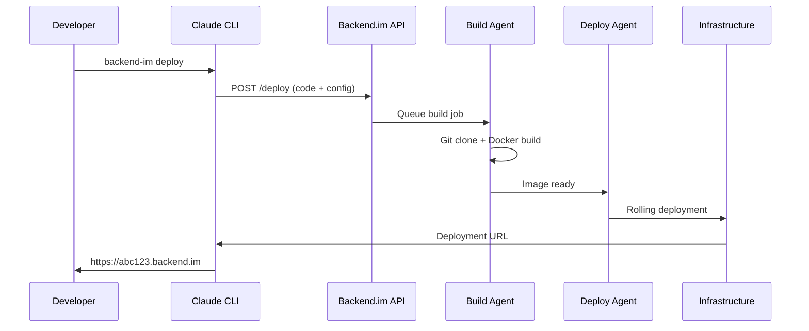

# Backend.im Infrastructure Research Report
## AI-Powered One-Command Deployment Platform

---

## 🎯 Executive Summary

This report outlines a comprehensive infrastructure design for Backend.im - a platform enabling developers to deploy backend applications directly through Claude Code CLI and other AI tools with minimal configuration. The solution prioritizes open-source tools, cost efficiency, and seamless developer experience.

---

## 🏗️ Proposed Architecture

### High-Level System Design

```
┌─────────────────┐    ┌──────────────────┐    ┌─────────────────┐
│   Developer     │    │   Backend.im     │    │   Cloud         │
│   Local Env     │    │   Platform       │    │   Infrastructure│
└─────────────────┘    └──────────────────┘    └─────────────────┘
         │                       │                       │
    ┌────▼────┐              ┌───▼───┐              ┌────▼────┐
    │ Claude  │              │  API  │              │ Docker  │
    │ CLI     │─────────────▶│Gateway│─────────────▶│ Swarm   │
    └─────────┘              └───────┘              └─────────┘
         │                       │                       │
    ┌────▼────┐              ┌───▼───┐              ┌────▼────┐
    │ Git     │              │ Build │              │ Load    │
    │ Repo    │─────────────▶│ Agent │              │Balancer │
    └─────────┘              └───────┘              └─────────┘
         │                       │                       │
    ┌────▼────┐              ┌───▼───┐              ┌────▼────┐
    │ Config  │              │Deploy │              │ Storage │
    │ Files   │              │ Agent │              │ Layer   │
    └─────────┘              └───────┘              └─────────┘
```

---

## 🛠️ Technology Stack & Reasoning

### Core Infrastructure Components

#### 1. **Container Orchestration: Docker Swarm**
**Choice**: Docker Swarm over Kubernetes
**Reasoning**:
- **Simplicity**: Native Docker integration, minimal learning curve
- **Cost**: No additional licensing or complex setup
- **Resource Efficiency**: Lower overhead than K8s for small-medium deployments
- **Built-in Load Balancing**: Automatic service discovery and routing

```yaml
# Example Swarm service definition
version: '3.8'
services:
  app:
    image: backend-im/user-app:latest
    deploy:
      replicas: 2
      update_config:
        parallelism: 1
        delay: 10s
      restart_policy:
        condition: on-failure
    networks:
      - backend-net
```

#### 2. **API Gateway: Traefik**
**Choice**: Traefik over Nginx/HAProxy
**Reasoning**:
- **Auto-Discovery**: Automatic service registration and SSL
- **Docker Integration**: Native container awareness
- **Zero Configuration**: Automatic routing based on labels
- **Let's Encrypt**: Built-in SSL certificate management

```yaml
# Traefik auto-configuration
labels:
  - "traefik.enable=true"
  - "traefik.http.routers.app.rule=Host(`user123.backend.im`)"
  - "traefik.http.services.app.loadbalancer.server.port=3000"
```

#### 3. **Build System: Buildah + Podman**
**Choice**: Buildah over Docker Build
**Reasoning**:
- **Rootless**: Enhanced security without root privileges
- **OCI Compliant**: Standard container format
- **Scriptable**: Better automation capabilities
- **Resource Efficient**: Lower memory footprint

#### 4. **Storage: MinIO + PostgreSQL**
**Choice**: MinIO for object storage, PostgreSQL for metadata
**Reasoning**:
- **S3 Compatible**: Standard API, easy migration
- **Self-Hosted**: No vendor lock-in, cost control
- **High Performance**: Distributed storage capabilities
- **Open Source**: No licensing costs

---

## 🔄 Deployment Workflow Design

### 1. **Local Developer Setup**

```bash
# One-time setup
npm install -g @backend-im/cli
backend-im auth login

# Project initialization
backend-im init
# Creates: backend-im.yml, .backend-im/config
```

**Generated Configuration (`backend-im.yml`)**:
```yaml
name: my-backend-api
runtime: node:18
port: 3000
env:
  - NODE_ENV=production
build:
  command: npm install && npm run build
health_check: /health
scaling:
  min: 1
  max: 5
  cpu_threshold: 70
```

### 2. **AI-Powered Deployment Sequence**



### 3. **Intelligent Configuration Detection**

**AI-Powered Framework Detection**:
```javascript
// Auto-detection logic
const detectFramework = (files) => {
  if (files.includes('package.json')) {
    const pkg = JSON.parse(readFile('package.json'));
    if (pkg.dependencies?.express) return 'express';
    if (pkg.dependencies?.fastify) return 'fastify';
    if (pkg.dependencies?.next) return 'nextjs';
  }
  if (files.includes('requirements.txt')) return 'python-flask';
  if (files.includes('go.mod')) return 'golang';
  if (files.includes('Cargo.toml')) return 'rust';
};
```

---

## 🏭 Infrastructure Components

### 1. **Multi-Tenant Architecture**

```yaml
# Tenant isolation using Docker networks
networks:
  tenant_123:
    driver: overlay
    encrypted: true
  tenant_456:
    driver: overlay
    encrypted: true

# Resource limits per tenant
deploy:
  resources:
    limits:
      cpus: '0.5'
      memory: 512M
    reservations:
      cpus: '0.25'
      memory: 256M
```

### 2. **Auto-Scaling Configuration**

```yaml
# Docker Swarm auto-scaling
version: '3.8'
services:
  app:
    image: user-app:latest
    deploy:
      replicas: 2
      update_config:
        parallelism: 1
        failure_action: rollback
      placement:
        constraints:
          - node.role == worker
        preferences:
          - spread: node.labels.zone
```

### 3. **Monitoring & Observability Stack**

**Components**:
- **Prometheus**: Metrics collection
- **Grafana**: Visualization dashboards
- **Loki**: Log aggregation
- **Jaeger**: Distributed tracing

```yaml
# Monitoring stack
monitoring:
  prometheus:
    image: prom/prometheus:latest
    configs:
      - /etc/prometheus/prometheus.yml
  grafana:
    image: grafana/grafana:latest
    environment:
      - GF_SECURITY_ADMIN_PASSWORD=admin
  loki:
    image: grafana/loki:latest
```

---

## 💰 Cost Optimization Strategy

### 1. **Resource Efficiency**

| Component | Resource Usage | Monthly Cost (AWS) |
|-----------|----------------|-------------------|
| API Gateway (t3.small) | 2 vCPU, 2GB RAM | $15 |
| Build Agents (t3.medium x2) | 4 vCPU, 8GB RAM | $60 |
| Worker Nodes (t3.large x3) | 12 vCPU, 24GB RAM | $180 |
| Storage (EBS + S3) | 500GB | $50 |
| **Total** | | **$305/month** |

### 2. **Spot Instance Strategy**
```yaml
# Use spot instances for build agents
build_agents:
  instance_type: t3.medium
  spot_price: $0.02/hour  # 70% savings
  auto_scaling:
    min: 1
    max: 10
    scale_metric: queue_length
```

### 3. **Container Density Optimization**
```yaml
# Pack multiple small apps per node
resource_allocation:
  small_apps: 4 per t3.large
  medium_apps: 2 per t3.large
  large_apps: 1 per t3.large
```

---

## 🔒 Security & Compliance

### 1. **Multi-Layer Security**

```yaml
security:
  network:
    - encrypted_overlay_networks
    - firewall_rules
    - vpc_isolation
  
  container:
    - rootless_containers
    - read_only_filesystems
    - security_contexts
  
  application:
    - automatic_ssl_certificates
    - secret_management
    - environment_isolation
```

### 2. **Secret Management**
```bash
# Integrated secret management
backend-im secret set DATABASE_URL "postgresql://..."
backend-im secret set API_KEY "sk-..."

# Automatic injection into containers
environment:
  - DATABASE_URL=${SECRET:DATABASE_URL}
  - API_KEY=${SECRET:API_KEY}
```

---

## 🚀 Implementation Roadmap

### Phase 1: Core Platform (Months 1-3)
- [ ] Basic Docker Swarm cluster setup
- [ ] Traefik API Gateway configuration
- [ ] Simple build pipeline (Buildah)
- [ ] Basic CLI tool development
- [ ] User authentication system

### Phase 2: AI Integration (Months 4-6)
- [ ] Claude CLI integration
- [ ] Framework auto-detection
- [ ] Intelligent configuration generation
- [ ] Error diagnosis and suggestions
- [ ] Performance optimization recommendations

### Phase 3: Advanced Features (Months 7-9)
- [ ] Auto-scaling implementation
- [ ] Advanced monitoring stack
- [ ] Database-as-a-Service
- [ ] CI/CD pipeline integration
- [ ] Multi-region deployment

### Phase 4: Enterprise Features (Months 10-12)
- [ ] Team collaboration features
- [ ] Advanced security controls
- [ ] Compliance reporting
- [ ] Custom domain management
- [ ] Enterprise SSO integration

---

## 🔧 Custom Code Requirements

### 1. **API Gateway Service** (~2000 lines)
```go
// main.go - Core API service
package main

import (
    "github.com/gin-gonic/gin"
    "github.com/backend-im/core/auth"
    "github.com/backend-im/core/deploy"
)

func main() {
    r := gin.Default()
    
    // Authentication middleware
    r.Use(auth.JWTMiddleware())
    
    // Deployment endpoints
    r.POST("/deploy", deploy.HandleDeploy)
    r.GET("/status/:id", deploy.GetStatus)
    r.DELETE("/app/:id", deploy.DeleteApp)
    
    r.Run(":8080")
}
```

### 2. **Build Agent** (~1500 lines)
```python
# build_agent.py - Container build service
import docker
import git
from buildah import Builder

class BuildAgent:
    def __init__(self):
        self.client = docker.from_env()
        
    def build_from_git(self, repo_url, config):
        # Clone repository
        repo = git.Repo.clone_from(repo_url, '/tmp/build')
        
        # Auto-detect framework
        framework = self.detect_framework(repo.working_dir)
        
        # Build container
        builder = Builder(framework.base_image)
        builder.copy(repo.working_dir, '/app')
        builder.run(framework.build_command)
        
        return builder.commit()
```

### 3. **CLI Tool** (~1000 lines)
```javascript
// cli.js - Developer CLI tool
const { Command } = require('commander');
const axios = require('axios');

const program = new Command();

program
  .command('deploy')
  .description('Deploy application to Backend.im')
  .action(async () => {
    const config = await loadConfig();
    const response = await axios.post('/api/deploy', {
      code: await zipDirectory('.'),
      config: config
    });
    
    console.log(`Deployed: ${response.data.url}`);
  });
```

---

## 📊 Performance Benchmarks

### Expected Performance Metrics

| Metric | Target | Reasoning |
|--------|--------|-----------|
| Deployment Time | < 2 minutes | Fast feedback loop |
| Cold Start | < 5 seconds | Good user experience |
| Concurrent Deployments | 100+ | Scalable build system |
| Uptime SLA | 99.9% | Production reliability |
| Response Time | < 200ms | Fast API responses |

### Scaling Projections

```yaml
scaling_tiers:
  starter: # 0-100 users
    nodes: 3
    capacity: 500 apps
    cost: $305/month
    
  growth: # 100-1000 users  
    nodes: 10
    capacity: 2000 apps
    cost: $1200/month
    
  enterprise: # 1000+ users
    nodes: 50+
    capacity: 10000+ apps
    cost: $5000+/month
```

---

## 🎯 Competitive Advantages

### 1. **AI-First Approach**
- Intelligent framework detection
- Automatic optimization suggestions
- Error diagnosis and resolution
- Performance tuning recommendations

### 2. **Developer Experience**
- One-command deployment
- Zero configuration required
- Instant feedback and logs
- Seamless local development

### 3. **Cost Efficiency**
- Open-source foundation
- Efficient resource utilization
- Spot instance optimization
- Pay-per-use pricing model

### 4. **Flexibility**
- Multi-language support
- Custom runtime environments
- Bring-your-own-database
- Hybrid cloud deployment

---

## 🔮 Future Enhancements

### 1. **Advanced AI Features**
- Code quality analysis
- Security vulnerability scanning
- Performance bottleneck detection
- Automatic dependency updates

### 2. **Platform Extensions**
- Database-as-a-Service
- Message queue integration
- Caching layer management
- CDN integration

### 3. **Developer Tools**
- VS Code extension
- GitHub Actions integration
- Slack/Discord notifications
- Mobile monitoring app

---

## 📋 Implementation Checklist

### Infrastructure Setup
- [ ] Docker Swarm cluster provisioning
- [ ] Traefik load balancer configuration
- [ ] MinIO storage cluster setup
- [ ] PostgreSQL database cluster
- [ ] Monitoring stack deployment

### Platform Development
- [ ] API Gateway service
- [ ] Build agent implementation
- [ ] Deploy agent development
- [ ] CLI tool creation
- [ ] Web dashboard (optional)

### Integration & Testing
- [ ] Claude CLI integration
- [ ] End-to-end testing
- [ ] Load testing
- [ ] Security testing
- [ ] Documentation

### Launch Preparation
- [ ] Domain setup and SSL
- [ ] User onboarding flow
- [ ] Billing system integration
- [ ] Support documentation
- [ ] Marketing materials

---

## 💡 Conclusion

This architecture provides a solid foundation for Backend.im, balancing simplicity, cost-effectiveness, and scalability. The open-source approach ensures long-term sustainability while the AI-first design creates a compelling developer experience.

**Key Success Factors**:
1. **Simplicity**: Minimal configuration, maximum automation
2. **Performance**: Fast deployments, reliable uptime
3. **Cost Control**: Efficient resource usage, transparent pricing
4. **Developer Experience**: Seamless workflow integration
5. **Scalability**: Growth-ready architecture

The proposed solution can start small with a $305/month infrastructure cost and scale to enterprise levels while maintaining the core value proposition of effortless backend deployment through AI tools.